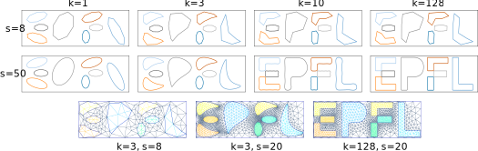

# PIC2FEM
## Convert 2D images to FEM meshes using openCV and GMSH

### Written by Mahmoud S. Shaqfa (EPFL-EESD)

The following is an example of this proposed approach, where we first show the input logo file:

The remeshing results:

*The first two rows show how the contours morph from low to high frequencies (k) and how the number of segment (s) affects the reconstruction; the contours were expanded with a maximum 2^7 harmonics. The last row shows the corresponding FEM mesh for different frequencies and segments to control the mesh refinements.*